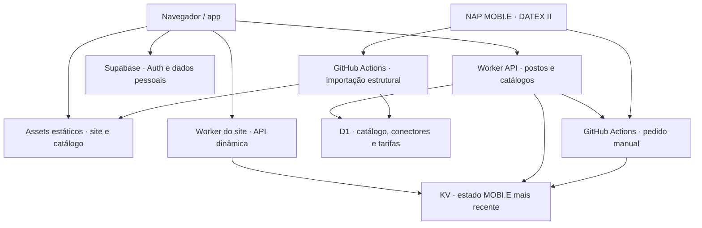

# ChargeVoy — estrutura e ligações

Estado analisado no PR #18 em 2026-09-29. Este documento descreve os fluxos presentes no código e a atualização por posto preparada neste ramo; não confirma a configuração efetiva de produção.

## Percurso do mapa

1. O site descarrega diretamente o catálogo nacional estático validado antes da publicação. Os postos e conectores entram no mapa sem consultar a D1.
2. A API dinâmica entrega o último estado do KV separadamente; o navegador junta a leitura aos conectores e mostra a hora da fonte. Se a KV falhar, usa a última leitura datada em cache.
3. Se o asset falhar, o site tenta páginas de postos no Worker local e depois no Worker API dedicado; os dois mantêm o fallback do catálogo estático quando a D1 falha.
4. A pesquisa de rotas usa os postos nacionais já carregados como alternativa aos pedidos por corredor.

## Disponibilidade

- A fonte publica uma hora própria. Uma leitura com até cinco minutos aparece como LIVE.
- Depois dos cinco minutos, a última cor conhecida é mantida com a indicação «Última leitura» e a idade da fonte. Uma leitura anterior não é apresentada como estado atual.
- «Atualizar este posto» só fica disponível para postos NAP. Quando a fonte está desatualizada, o Worker API solicita uma recolha nacional, limitada a um pedido em cinco minutos no KV. O navegador consulta de novo apenas os conectores do posto selecionado até surgir uma publicação mais recente ou terminar a espera.
- Uma recolha pode terminar sem estado novo para esse posto. Nesse caso a interface conserva a última leitura e explica que a fonte ainda não publicou outra.

## Operação e rollback

- Publicar o site e o Worker a partir de um commit validado; testar mapa nacional, filtros, rota e disponibilidade após a publicação.
- Os workflows de deploy tentam repor automaticamente a versão anterior do respetivo Worker se a verificação após a publicação falhar. Confirmar depois o snapshot estático e a leitura do KV. Não há migração de esquema neste conjunto de alterações.
- Métricas a acompanhar: idade da publicação MOBI.E, sucesso da GitHub Action, pedidos e leituras KV, pedidos Worker, linhas lidas e escritas D1.
