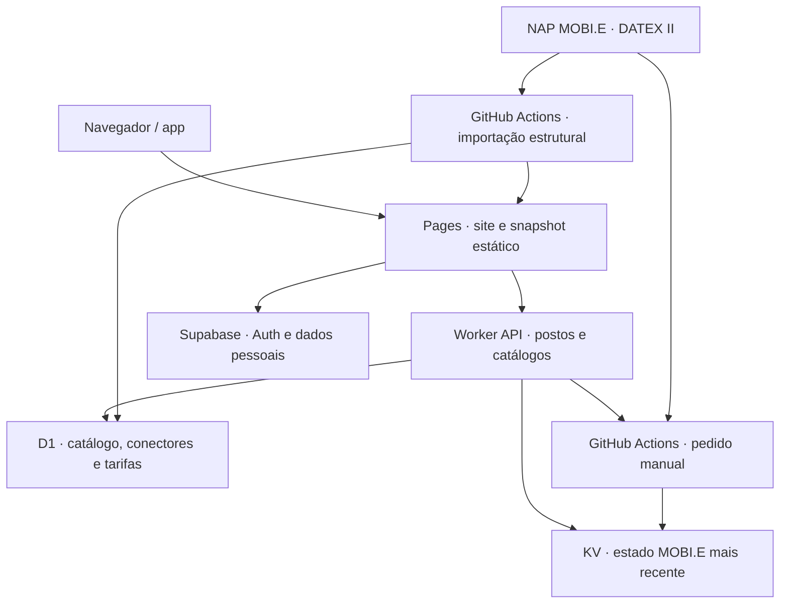

# ChargeVoy — estrutura e ligações

Estado analisado no PR #18 em 2026-09-29. Este documento descreve os fluxos presentes no código e a atualização por posto preparada neste ramo; não confirma a configuração efetiva de produção.

## Percurso do mapa

1. O site pede páginas de postos ao Worker local e, se necessário, ao Worker API dedicado.
2. O Worker lê o catálogo da D1, com cache de páginas estruturais. A disponibilidade é aplicada do KV depois da leitura da cache.
3. Se a D1 falhar no Worker local, o catálogo estático nacional mantém os postos no mapa. A aplicação também tenta esse ficheiro diretamente.
4. A pesquisa de rotas pede postos nas secções do corredor e mantém o conjunto local como alternativa.

## Disponibilidade

- A fonte publica uma hora própria. Uma leitura com até cinco minutos aparece como LIVE.
- Depois dos cinco minutos, a última cor conhecida é mantida com a indicação «Última leitura» e a idade da fonte. Uma leitura anterior não é apresentada como estado atual.
- «Atualizar este posto» só fica disponível para postos NAP. Quando a fonte está desatualizada, o Worker API solicita uma recolha nacional, limitada a um pedido em cinco minutos no KV. O navegador consulta de novo apenas os conectores do posto selecionado até surgir uma publicação mais recente ou terminar a espera.
- Uma recolha pode terminar sem estado novo para esse posto. Nesse caso a interface conserva a última leitura e explica que a fonte ainda não publicou outra.

## Operação e rollback

- Publicar o site e o Worker a partir de um commit validado; testar mapa nacional, filtros, rota e disponibilidade após a publicação.
- Para reverter, repor os ficheiros web e o Worker API do commit anterior e confirmar o snapshot estático e a leitura do KV. Não há migração de esquema ou escrita na D1 neste conjunto de alterações.
- Métricas a acompanhar: idade da publicação MOBI.E, sucesso da GitHub Action, pedidos e leituras KV, pedidos Worker, linhas lidas e escritas D1.
